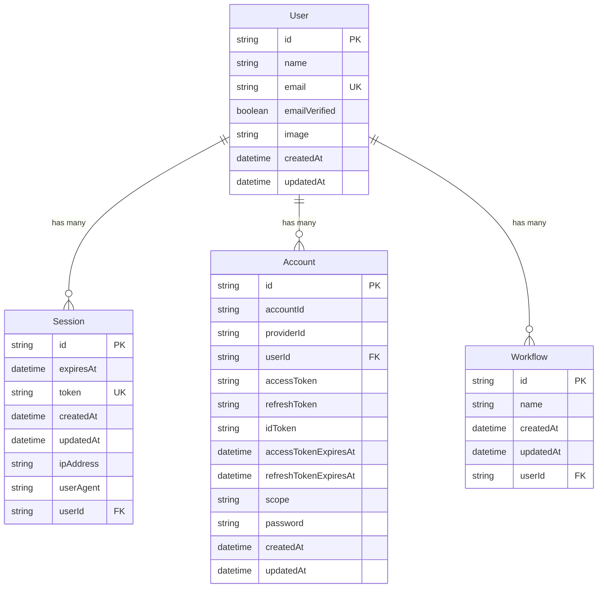

# Database Schema Documentation

This document provides comprehensive information about the database schema, relationships, and data models used in the Saku-AI application.

## Table of Contents

1. [Overview](#overview)
2. [Database Configuration](#database-configuration)
3. [Models](#models)
4. [Relationships](#relationships)
5. [Indexes](#indexes)
6. [Migrations](#migrations)
7. [Query Examples](#query-examples)

## Overview

The Saku-AI application uses PostgreSQL as the primary database with Prisma ORM for type-safe database operations. The schema is designed to support:

- User authentication and session management
- Workflow management and execution
- Subscription and billing integration
- OAuth account linking

## Database Configuration

### Prisma Configuration

```prisma
// prisma/schema.prisma
generator client {
  provider = "prisma-client-js"
  output   = "../src/generated/prisma"
}

datasource db {
  provider = "postgresql"
  url      = env("DATABASE_URL")
}
```

### Connection Setup

```typescript
// src/lib/db.ts
import { PrismaClient } from '@/generated/prisma';

const globalForPrisma = globalThis as unknown as {
  prisma: PrismaClient | undefined;
};

export const prisma = globalForPrisma.prisma ?? new PrismaClient();

if (process.env.NODE_ENV !== 'production') globalForPrisma.prisma = prisma;
```

## Models

### User Model

The central user model that represents application users.

```prisma
model User {
  id            String    @id
  name          String
  email         String
  emailVerified Boolean   @default(false)
  image         String?
  createdAt     DateTime  @default(now())
  updatedAt     DateTime  @default(now()) @updatedAt
  
  // Relationships
  sessions      Session[]
  accounts      Account[]
  workflows     Workflow[]

  @@unique([email])
  @@map("user")
}
```

**Fields:**
- `id`: Primary key (string)
- `name`: User's display name
- `email`: Unique email address
- `emailVerified`: Email verification status
- `image`: Optional profile image URL
- `createdAt`: Account creation timestamp
- `updatedAt`: Last update timestamp

**Constraints:**
- Email must be unique
- All fields except `image` are required

### Session Model

Manages user sessions for authentication.

```prisma
model Session {
  id        String   @id
  expiresAt DateTime
  token     String
  createdAt DateTime @default(now())
  updatedAt DateTime @updatedAt
  ipAddress String?
  userAgent String?
  userId    String
  
  // Relationships
  user      User     @relation(fields: [userId], references: [id], onDelete: Cascade)

  @@unique([token])
  @@map("session")
}
```

**Fields:**
- `id`: Primary key (string)
- `expiresAt`: Session expiration timestamp
- `token`: Unique session token
- `createdAt`: Session creation timestamp
- `updatedAt`: Last update timestamp
- `ipAddress`: Optional client IP address
- `userAgent`: Optional client user agent
- `userId`: Foreign key to User

**Constraints:**
- Token must be unique
- Cascade delete when user is deleted

### Account Model

Stores OAuth account information and credentials.

```prisma
model Account {
  id                    String    @id
  accountId             String
  providerId            String
  userId                String
  accessToken           String?
  refreshToken          String?
  idToken               String?
  accessTokenExpiresAt  DateTime?
  refreshTokenExpiresAt DateTime?
  scope                 String?
  password              String?
  createdAt             DateTime  @default(now())
  updatedAt             DateTime  @updatedAt
  
  // Relationships
  user                  User      @relation(fields: [userId], references: [id], onDelete: Cascade)

  @@map("account")
}
```

**Fields:**
- `id`: Primary key (string)
- `accountId`: Provider-specific account ID
- `providerId`: OAuth provider identifier
- `userId`: Foreign key to User
- `accessToken`: OAuth access token
- `refreshToken`: OAuth refresh token
- `idToken`: OAuth ID token
- `accessTokenExpiresAt`: Access token expiration
- `refreshTokenExpiresAt`: Refresh token expiration
- `scope`: OAuth scope permissions
- `password`: Hashed password (for email/password auth)
- `createdAt`: Account creation timestamp
- `updatedAt`: Last update timestamp

**Constraints:**
- Cascade delete when user is deleted

### Verification Model

Handles email verification and password reset tokens.

```prisma
model Verification {
  id         String   @id
  identifier String
  value      String
  expiresAt  DateTime
  createdAt  DateTime @default(now())
  updatedAt  DateTime @default(now()) @updatedAt

  @@map("verification")
}
```

**Fields:**
- `id`: Primary key (string)
- `identifier`: Email or phone number
- `value`: Verification token
- `expiresAt`: Token expiration timestamp
- `createdAt`: Token creation timestamp
- `updatedAt`: Last update timestamp

### Workflow Model

Represents user-created workflows.

```prisma
model Workflow {
  id          String   @id @default(cuid())
  name        String
  createdAt   DateTime @default(now())
  updatedAt   DateTime @updatedAt
  
  // Relationships
  userId String
  user   User   @relation(fields: [userId], references: [id], onDelete: Cascade)
}
```

**Fields:**
- `id`: Primary key (CUID)
- `name`: Workflow name
- `createdAt`: Workflow creation timestamp
- `updatedAt`: Last update timestamp
- `userId`: Foreign key to User

**Constraints:**
- Cascade delete when user is deleted

## Relationships

### User Relationships



### Relationship Details

#### User → Sessions (One-to-Many)
- A user can have multiple active sessions
- Sessions are automatically cleaned up when user is deleted
- Used for authentication and session management

#### User → Accounts (One-to-Many)
- A user can have multiple OAuth accounts
- Supports multiple authentication providers
- Accounts are deleted when user is deleted

#### User → Workflows (One-to-Many)
- A user can create multiple workflows
- Workflows are deleted when user is deleted
- Supports workflow ownership and access control

## Indexes

### Automatic Indexes

Prisma automatically creates indexes for:

- Primary keys (`id` fields)
- Unique constraints (`email`, `token`)
- Foreign keys (`userId` fields)

### Recommended Custom Indexes

```prisma
// Add to schema.prisma for better query performance
model User {
  // ... existing fields
  
  @@index([email])
  @@index([createdAt])
}

model Session {
  // ... existing fields
  
  @@index([userId])
  @@index([expiresAt])
  @@index([token])
}

model Workflow {
  // ... existing fields
  
  @@index([userId])
  @@index([createdAt])
  @@index([updatedAt])
}
```

## Migrations

### Running Migrations

```bash
# Create a new migration
npx prisma migrate dev --name your-migration-name

# Apply migrations to production
npx prisma migrate deploy

# Reset database (development only)
npx prisma migrate reset
```

### Migration History

1. **Initial Migration**: Basic user, session, account, verification tables
2. **Workflows Table**: Added workflow management
3. **Workflows Update**: Enhanced workflow functionality

### Example Migration

```sql
-- Migration: Add workflow table
CREATE TABLE "Workflow" (
    "id" TEXT NOT NULL,
    "name" TEXT NOT NULL,
    "createdAt" TIMESTAMP(3) NOT NULL DEFAULT CURRENT_TIMESTAMP,
    "updatedAt" TIMESTAMP(3) NOT NULL,
    "userId" TEXT NOT NULL,

    CONSTRAINT "Workflow_pkey" PRIMARY KEY ("id")
);

-- Add foreign key constraint
ALTER TABLE "Workflow" ADD CONSTRAINT "Workflow_userId_fkey" 
FOREIGN KEY ("userId") REFERENCES "user"("id") ON DELETE CASCADE ON UPDATE CASCADE;
```

## Query Examples

### Basic CRUD Operations

#### Create User
```typescript
const user = await prisma.user.create({
  data: {
    id: 'user_123',
    name: 'John Doe',
    email: 'john@example.com',
    emailVerified: false,
  },
});
```

#### Create Workflow
```typescript
const workflow = await prisma.workflow.create({
  data: {
    name: 'My Workflow',
    userId: 'user_123',
  },
});
```

#### Read User with Workflows
```typescript
const user = await prisma.user.findUnique({
  where: { id: 'user_123' },
  include: {
    workflows: {
      orderBy: { updatedAt: 'desc' },
    },
    sessions: true,
    accounts: true,
  },
});
```

#### Update Workflow
```typescript
const updatedWorkflow = await prisma.workflow.update({
  where: { id: 'workflow_123' },
  data: { name: 'Updated Workflow Name' },
});
```

#### Delete Workflow
```typescript
await prisma.workflow.delete({
  where: { id: 'workflow_123' },
});
```

### Advanced Queries

#### Paginated Workflows
```typescript
const workflows = await prisma.workflow.findMany({
  where: {
    userId: 'user_123',
    name: {
      contains: 'search term',
      mode: 'insensitive',
    },
  },
  skip: 0,
  take: 20,
  orderBy: { updatedAt: 'desc' },
});
```

#### User Statistics
```typescript
const userStats = await prisma.user.findUnique({
  where: { id: 'user_123' },
  select: {
    _count: {
      select: {
        workflows: true,
        sessions: true,
        accounts: true,
      },
    },
  },
});
```

#### Active Sessions
```typescript
const activeSessions = await prisma.session.findMany({
  where: {
    userId: 'user_123',
    expiresAt: {
      gt: new Date(),
    },
  },
  orderBy: { createdAt: 'desc' },
});
```

#### Workflow Search
```typescript
const searchResults = await prisma.workflow.findMany({
  where: {
    userId: 'user_123',
    OR: [
      { name: { contains: 'search', mode: 'insensitive' } },
    ],
  },
  orderBy: [
    { updatedAt: 'desc' },
    { name: 'asc' },
  ],
});
```

### Transaction Examples

#### Create User with Workflow
```typescript
const result = await prisma.$transaction(async (tx) => {
  const user = await tx.user.create({
    data: {
      id: 'user_123',
      name: 'John Doe',
      email: 'john@example.com',
    },
  });

  const workflow = await tx.workflow.create({
    data: {
      name: 'Default Workflow',
      userId: user.id,
    },
  });

  return { user, workflow };
});
```

#### Bulk Operations
```typescript
const workflows = await prisma.workflow.createMany({
  data: [
    { name: 'Workflow 1', userId: 'user_123' },
    { name: 'Workflow 2', userId: 'user_123' },
    { name: 'Workflow 3', userId: 'user_123' },
  ],
});
```

### Aggregation Queries

#### Count Workflows by User
```typescript
const workflowCounts = await prisma.user.findMany({
  select: {
    id: true,
    name: true,
    _count: {
      select: {
        workflows: true,
      },
    },
  },
});
```

#### Recent Activity
```typescript
const recentWorkflows = await prisma.workflow.findMany({
  where: {
    userId: 'user_123',
    updatedAt: {
      gte: new Date(Date.now() - 7 * 24 * 60 * 60 * 1000), // Last 7 days
    },
  },
  orderBy: { updatedAt: 'desc' },
});
```

## Performance Considerations

### Query Optimization

1. **Use Select**: Only fetch needed fields
   ```typescript
   const users = await prisma.user.findMany({
     select: { id: true, name: true, email: true },
   });
   ```

2. **Use Include Wisely**: Avoid N+1 queries
   ```typescript
   const users = await prisma.user.findMany({
     include: { workflows: true },
   });
   ```

3. **Use Pagination**: For large datasets
   ```typescript
   const workflows = await prisma.workflow.findMany({
     skip: (page - 1) * pageSize,
     take: pageSize,
   });
   ```

### Connection Management

```typescript
// Connection pooling in production
const prisma = new PrismaClient({
  datasources: {
    db: {
      url: process.env.DATABASE_URL,
    },
  },
  log: ['query', 'info', 'warn', 'error'],
});
```

## Security Considerations

### Data Protection

1. **Input Validation**: Use Zod schemas
2. **SQL Injection**: Prisma prevents SQL injection
3. **Access Control**: Implement proper authorization
4. **Data Encryption**: Sensitive data should be encrypted

### Best Practices

1. **Use Transactions**: For related operations
2. **Validate Input**: Before database operations
3. **Handle Errors**: Proper error handling
4. **Monitor Performance**: Use Prisma logging
5. **Backup Data**: Regular database backups

## Monitoring and Maintenance

### Database Monitoring

```typescript
// Enable query logging
const prisma = new PrismaClient({
  log: [
    { emit: 'event', level: 'query' },
    { emit: 'event', level: 'error' },
    { emit: 'event', level: 'info' },
    { emit: 'event', level: 'warn' },
  ],
});

prisma.$on('query', (e) => {
  console.log('Query: ' + e.query);
  console.log('Params: ' + e.params);
  console.log('Duration: ' + e.duration + 'ms');
});
```

### Health Checks

```typescript
// Database health check
export async function checkDatabaseHealth() {
  try {
    await prisma.$queryRaw`SELECT 1`;
    return { status: 'healthy', timestamp: new Date() };
  } catch (error) {
    return { status: 'unhealthy', error: error.message, timestamp: new Date() };
  }
}
```
