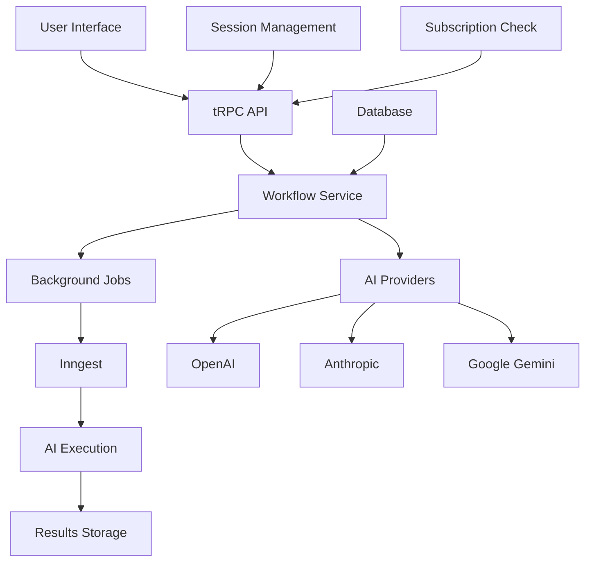

# Workflow System Documentation

This document provides comprehensive information about the workflow system, AI integration, and background job processing in the Saku-AI application.

## Table of Contents

1. [Overview](#overview)
2. [Workflow Architecture](#workflow-architecture)
3. [AI Integration](#ai-integration)
4. [Background Jobs](#background-jobs)
5. [Implementation Guide](#implementation-guide)
6. [API Reference](#api-reference)
7. [Best Practices](#best-practices)

## Overview

The Saku-AI workflow system enables users to create, manage, and execute AI-powered workflows using multiple AI providers. The system supports:

- **Multi-Provider AI**: OpenAI, Anthropic, Google Gemini
- **Background Processing**: Asynchronous job execution with Inngest
- **Workflow Management**: CRUD operations for user workflows
- **Real-time Updates**: Progress tracking and status updates
- **Subscription Integration**: Premium features for advanced workflows

## Workflow Architecture

### System Components



### Data Flow

1. **User Creates Workflow**: Frontend → tRPC → Database
2. **Workflow Execution**: tRPC → Inngest → AI Providers
3. **Result Processing**: AI Providers → Inngest → Database
4. **Status Updates**: Database → tRPC → Frontend

## AI Integration

### Supported AI Providers

#### OpenAI Integration

```typescript
// src/ingest/functions.ts
import { createOpenAI } from '@ai-sdk/openai';
import { generateText } from 'ai';

const openai = createOpenAI();

export const executeAI = inngest.createFunction(
  { id: 'execute-ai' },
  { event: 'execute/ai' },
  async ({ event, step }) => {
    const { steps: openaiSteps } = await step.ai.wrap(
      'openai-generate-text',
      generateText,
      {
        system: 'You are a helpful assistant that generates text based on user prompts.',
        prompt: 'what is 2+2?',
        model: openai('gpt-4o'),
      }
    );

    return { openaiSteps };
  }
);
```

#### Anthropic Integration

```typescript
import { createAnthropic } from '@ai-sdk/anthropic';

const anthropic = createAnthropic();

const { steps: anthropicSteps } = await step.ai.wrap(
  'anthropic-generate-text',
  generateText,
  {
    system: 'You are a helpful assistant that generates text based on user prompts.',
    prompt: 'what is 2+2?',
    model: anthropic('claude-sonnet-4-5'),
  }
);
```

#### Google Gemini Integration

```typescript
import { createGoogleGenerativeAI } from '@ai-sdk/google';

const google = createGoogleGenerativeAI();

const { steps: geminiSteps } = await step.ai.wrap(
  'gemini-generate-text',
  generateText,
  {
    system: 'You are a helpful assistant that generates text based on user prompts.',
    prompt: 'what is 2+2?',
    experimental_telemetry: {
      isEnabled: true,
      recordInputs: true,
      recordOutputs: true,
    },
    model: google('gemini-2.5-flash'),
  }
);
```

### AI Configuration

#### Environment Variables

```env
# AI Provider API Keys
OPENAI_API_KEY="your-openai-key"
ANTHROPIC_API_KEY="your-anthropic-key"
GOOGLE_API_KEY="your-google-key"

# Inngest Configuration
INNGEST_EVENT_KEY="your-inngest-key"
INNGEST_SIGNING_KEY="your-signing-key"
```

#### Provider Setup

```typescript
// src/ingest/functions.ts
import { createGoogleGenerativeAI } from '@ai-sdk/google';
import { createOpenAI } from '@ai-sdk/openai';
import { createAnthropic } from '@ai-sdk/anthropic';
import { generateText } from 'ai';
import { inngest } from './client';

// Initialize AI providers
const google = createGoogleGenerativeAI();
const openai = createOpenAI();
const anthropic = createAnthropic();
```

## Background Jobs

### Inngest Configuration

#### Client Setup

```typescript
// src/ingest/client.ts
import { Inngest } from 'inngest';

export const inngest = new Inngest({
  id: 'saku-ai',
  name: 'Saku AI Workflow Engine',
});
```

#### Job Functions

```typescript
// src/ingest/functions.ts
export const execute = inngest.createFunction(
  { id: 'execute-ai' },
  { event: 'execute/ai' },
  async ({ event, step }) => {
    // Simulate processing time
    await step.sleep('pretend', '5s');
    
    // Execute with multiple AI providers
    const { steps: geminiSteps } = await step.ai.wrap(
      'gemini-generate-text',
      generateText,
      {
        system: 'You are a helpful assistant that generates text based on user prompts.',
        prompt: 'what is 2+2?',
        experimental_telemetry: {
          isEnabled: true,
          recordInputs: true,
          recordOutputs: true,
        },
        model: google('gemini-2.5-flash'),
      }
    );

    const { steps: openaiSteps } = await step.ai.wrap(
      'openai-generate-text',
      generateText,
      {
        system: 'You are a helpful assistant that generates text based on user prompts.',
        prompt: 'what is 2+2?',
        model: openai('gpt-4o'),
      }
    );

    const { steps: anthropicSteps } = await step.ai.wrap(
      'anthropic-generate-text',
      generateText,
      {
        system: 'You are a helpful assistant that generates text based on user prompts.',
        prompt: 'what is 2+2?',
        model: anthropic('claude-sonnet-4-5'),
      }
    );

    return { geminiSteps, openaiSteps, anthropicSteps };
  }
);
```

#### API Endpoint

```typescript
// src/app/api/inngest/route.ts
import { serve } from 'inngest/next';
import { inngest } from '@/ingest/client';
import { execute } from '@/ingest/functions';

export const { GET, POST, PUT } = serve({
  client: inngest,
  functions: [execute],
});
```

### Job Execution

#### Triggering Jobs

```typescript
// Trigger AI execution job
import { inngest } from '@/ingest/client';

export async function executeWorkflow(workflowId: string, prompt: string) {
  await inngest.send({
    name: 'execute/ai',
    data: {
      workflowId,
      prompt,
      userId: 'user_123',
    },
  });
}
```

#### Job Status Tracking

```typescript
// Track job progress
export const trackExecution = inngest.createFunction(
  { id: 'track-execution' },
  { event: 'workflow/execute' },
  async ({ event, step }) => {
    const { workflowId, userId } = event.data;
    
    // Update workflow status
    await step.run('update-status', async () => {
      await prisma.workflow.update({
        where: { id: workflowId },
        data: { status: 'running' },
      });
    });
    
    // Execute AI workflow
    const result = await step.run('execute-ai', async () => {
      return await executeAIWorkflow(event.data);
    });
    
    // Update with results
    await step.run('save-results', async () => {
      await prisma.workflow.update({
        where: { id: workflowId },
        data: { 
          status: 'completed',
          result: JSON.stringify(result),
        },
      });
    });
  }
);
```

## Implementation Guide

### Creating a New Workflow

#### 1. Database Model

```prisma
// prisma/schema.prisma
model Workflow {
  id          String   @id @default(cuid())
  name        String
  status      String   @default("draft") // draft, running, completed, failed
  result      String?
  prompt      String?
  createdAt   DateTime @default(now())
  updatedAt   DateTime @updatedAt
  
  userId String
  user   User   @relation(fields: [userId], references: [id], onDelete: Cascade)
}
```

#### 2. tRPC Router

```typescript
// src/features/workflows/server/routers.ts
export const workflowsRouter = createTRPCRouter({
  create: premiumProcedure.mutation(({ ctx }) => {
    return prisma.workflow.create({
      data: {
        name: generateSlug(3),
        userId: ctx.auth.user.id,
      },
    });
  }),

  execute: premiumProcedure
    .input(z.object({
      id: z.string(),
      prompt: z.string(),
    }))
    .mutation(async ({ ctx, input }) => {
      // Update workflow status
      await prisma.workflow.update({
        where: { id: input.id, userId: ctx.auth.user.id },
        data: { 
          status: 'running',
          prompt: input.prompt,
        },
      });

      // Trigger background job
      await inngest.send({
        name: 'execute/ai',
        data: {
          workflowId: input.id,
          prompt: input.prompt,
          userId: ctx.auth.user.id,
        },
      });

      return { success: true };
    }),
});
```

#### 3. Client Hooks

```typescript
// src/features/workflows/hooks/use-workflows.ts
export const useExecuteWorkflow = () => {
  const queryClient = useQueryClient();
  const trpc = useTRPC();

  return useMutation(
    trpc.workflows.execute.mutationOptions({
      onSuccess: (data) => {
        toast.success('Workflow execution started');
        queryClient.invalidateQueries(trpc.workflows.getMany.queryOptions());
      },
      onError: (error) => {
        toast.error(`Failed to execute workflow: ${error.message}`);
      },
    })
  );
};
```

#### 4. UI Components

```typescript
// src/features/workflows/components/workflow-executor.tsx
export const WorkflowExecutor = ({ workflowId }: { workflowId: string }) => {
  const [prompt, setPrompt] = useState('');
  const executeWorkflow = useExecuteWorkflow();

  const handleExecute = () => {
    executeWorkflow.mutate({
      id: workflowId,
      prompt,
    });
  };

  return (
    <div className="space-y-4">
      <Textarea
        placeholder="Enter your prompt..."
        value={prompt}
        onChange={(e) => setPrompt(e.target.value)}
      />
      <Button 
        onClick={handleExecute}
        disabled={executeWorkflow.isPending}
      >
        {executeWorkflow.isPending ? 'Executing...' : 'Execute Workflow'}
      </Button>
    </div>
  );
};
```

### Advanced Workflow Features

#### Workflow Templates

```typescript
// src/features/workflows/templates.ts
export const workflowTemplates = {
  contentGeneration: {
    name: 'Content Generation',
    prompt: 'Generate high-quality content about: {topic}',
    providers: ['openai', 'anthropic'],
  },
  codeReview: {
    name: 'Code Review',
    prompt: 'Review this code for best practices: {code}',
    providers: ['openai', 'gemini'],
  },
  translation: {
    name: 'Translation',
    prompt: 'Translate the following text to {language}: {text}',
    providers: ['openai', 'anthropic', 'gemini'],
  },
};
```

#### Workflow Scheduling

```typescript
// Schedule recurring workflows
export const scheduleWorkflow = inngest.createFunction(
  { id: 'schedule-workflow' },
  { event: 'workflow/schedule' },
  async ({ event, step }) => {
    const { workflowId, schedule } = event.data;
    
    // Schedule recurring execution
    await step.sleep('wait-for-schedule', schedule);
    
    // Execute workflow
    await step.run('execute-scheduled', async () => {
      await inngest.send({
        name: 'execute/ai',
        data: { workflowId },
      });
    });
  }
);
```

#### Workflow Chaining

```typescript
// Chain multiple AI operations
export const chainWorkflows = inngest.createFunction(
  { id: 'chain-workflows' },
  { event: 'workflow/chain' },
  async ({ event, step }) => {
    const { workflowIds } = event.data;
    let result = event.data.input;
    
    for (const workflowId of workflowIds) {
      result = await step.run(`execute-${workflowId}`, async () => {
        return await executeWorkflow(workflowId, result);
      });
    }
    
    return { finalResult: result };
  }
);
```

## API Reference

### Workflow Endpoints

#### Create Workflow

```typescript
POST /api/trpc/workflows.create
```

**Request:**
```json
{}
```

**Response:**
```json
{
  "id": "workflow_123",
  "name": "random-generated-name",
  "status": "draft",
  "createdAt": "2024-01-01T00:00:00Z",
  "updatedAt": "2024-01-01T00:00:00Z",
  "userId": "user_123"
}
```

#### Execute Workflow

```typescript
POST /api/trpc/workflows.execute
```

**Request:**
```json
{
  "id": "workflow_123",
  "prompt": "Generate a story about a robot"
}
```

**Response:**
```json
{
  "success": true
}
```

#### Get Workflow

```typescript
GET /api/trpc/workflows.getOne
```

**Request:**
```json
{
  "id": "workflow_123"
}
```

**Response:**
```json
{
  "id": "workflow_123",
  "name": "My Workflow",
  "status": "completed",
  "result": "{\"story\": \"Once upon a time...\"}",
  "prompt": "Generate a story about a robot",
  "createdAt": "2024-01-01T00:00:00Z",
  "updatedAt": "2024-01-01T00:05:00Z",
  "userId": "user_123"
}
```

### Background Job Events

#### Execute AI Event

```typescript
{
  "name": "execute/ai",
  "data": {
    "workflowId": "workflow_123",
    "prompt": "Generate content about AI",
    "userId": "user_123"
  }
}
```

#### Workflow Status Update

```typescript
{
  "name": "workflow/status-update",
  "data": {
    "workflowId": "workflow_123",
    "status": "completed",
    "result": "{\"content\": \"AI is transforming...\"}"
  }
}
```

## Best Practices

### Performance Optimization

1. **Batch AI Requests**
   ```typescript
   // Execute multiple AI calls in parallel
   const [openaiResult, anthropicResult, geminiResult] = await Promise.all([
     executeOpenAI(prompt),
     executeAnthropic(prompt),
     executeGemini(prompt),
   ]);
   ```

2. **Cache Results**
   ```typescript
   // Cache AI responses for similar prompts
   const cacheKey = `ai-response-${hashPrompt(prompt)}`;
   const cached = await redis.get(cacheKey);
   if (cached) return JSON.parse(cached);
   
   const result = await executeAI(prompt);
   await redis.setex(cacheKey, 3600, JSON.stringify(result));
   ```

3. **Rate Limiting**
   ```typescript
   // Implement rate limiting for AI requests
   const rateLimit = new Map();
   const userRequests = rateLimit.get(userId) || 0;
   if (userRequests > 10) {
     throw new Error('Rate limit exceeded');
   }
   ```

### Error Handling

```typescript
// Comprehensive error handling for AI workflows
export const executeWithRetry = async (fn: () => Promise<any>, maxRetries = 3) => {
  for (let i = 0; i < maxRetries; i++) {
    try {
      return await fn();
    } catch (error) {
      if (i === maxRetries - 1) throw error;
      await new Promise(resolve => setTimeout(resolve, 1000 * (i + 1)));
    }
  }
};
```

### Monitoring and Logging

```typescript
// Monitor AI workflow execution
export const executeWithMonitoring = inngest.createFunction(
  { id: 'execute-with-monitoring' },
  { event: 'execute/ai' },
  async ({ event, step }) => {
    const startTime = Date.now();
    
    try {
      const result = await step.run('execute-ai', async () => {
        return await executeAIWorkflow(event.data);
      });
      
      // Log success
      console.log(`Workflow ${event.data.workflowId} completed in ${Date.now() - startTime}ms`);
      
      return result;
    } catch (error) {
      // Log error
      console.error(`Workflow ${event.data.workflowId} failed:`, error);
      throw error;
    }
  }
);
```

### Security Considerations

1. **Input Validation**
   ```typescript
   // Validate workflow inputs
   const workflowSchema = z.object({
     prompt: z.string().min(1).max(10000),
     userId: z.string().uuid(),
   });
   ```

2. **Rate Limiting**
   ```typescript
   // Limit AI requests per user
   const userLimits = await getUserLimits(userId);
   if (userLimits.requestsToday >= userLimits.maxRequests) {
     throw new Error('Daily limit exceeded');
   }
   ```

3. **Content Filtering**
   ```typescript
   // Filter inappropriate content
   const filteredPrompt = await filterContent(prompt);
   if (filteredPrompt !== prompt) {
     throw new Error('Content not allowed');
   }
   ```

This comprehensive workflow system documentation provides all the information needed to understand, implement, and extend the workflow functionality in the Saku-AI application.
